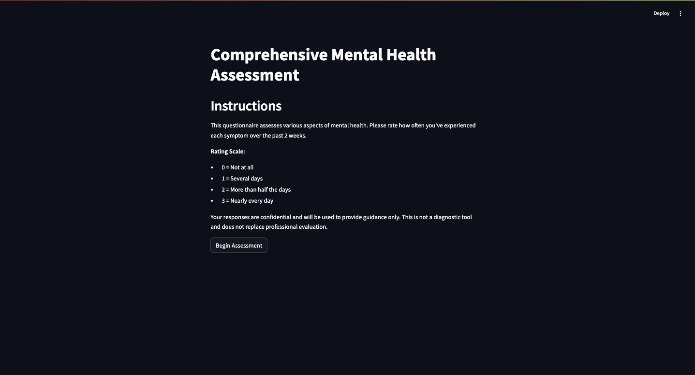
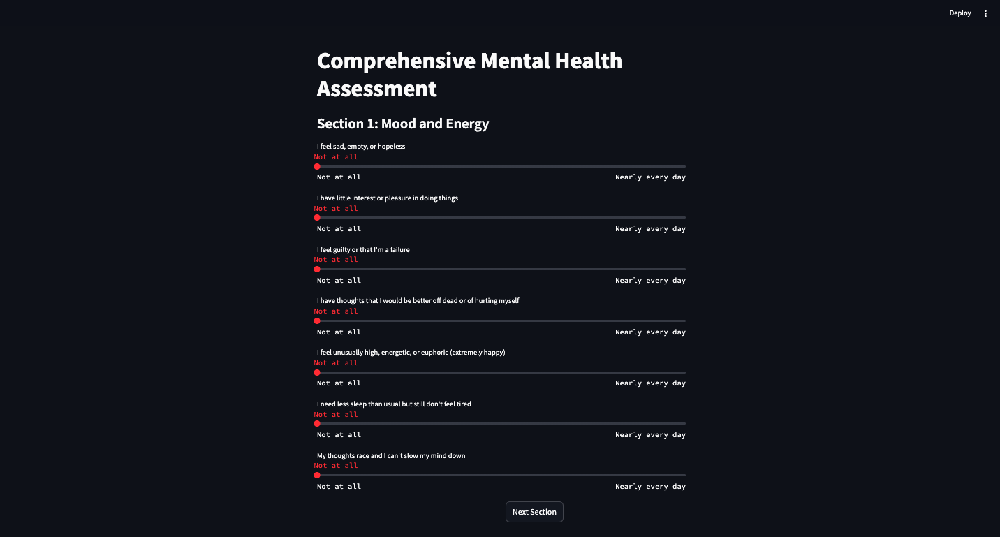
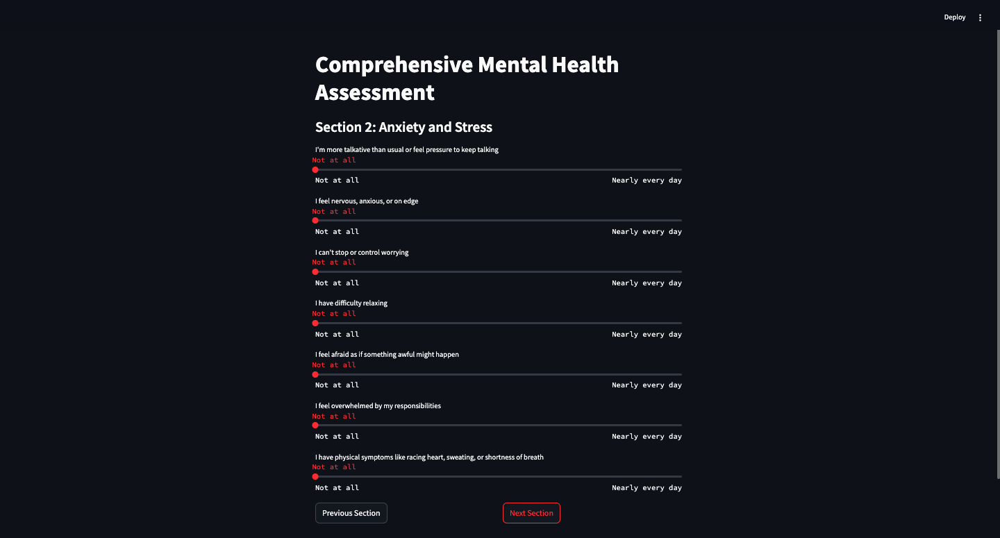
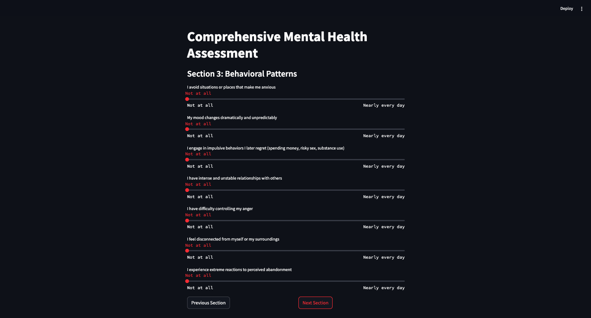
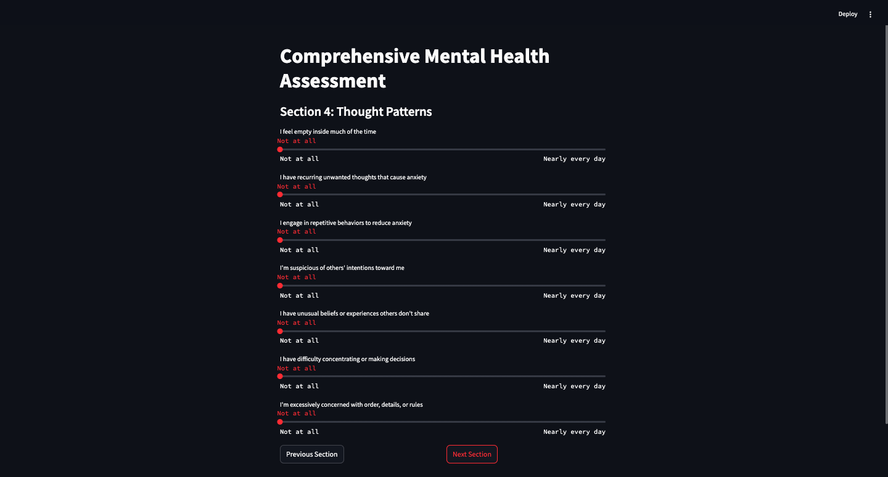
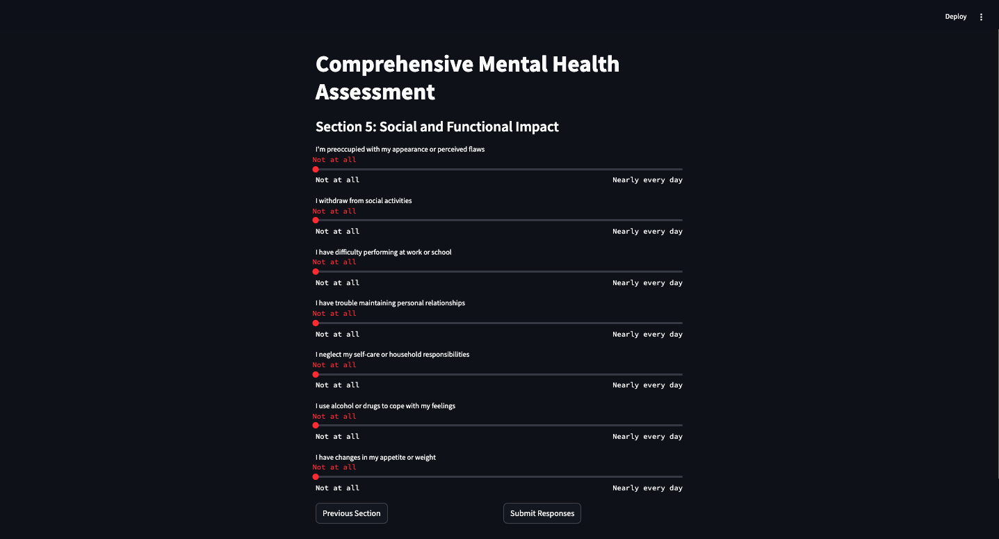
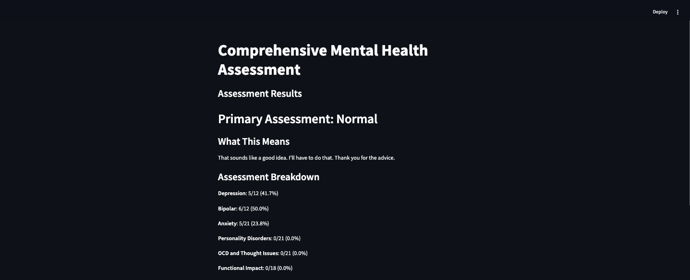
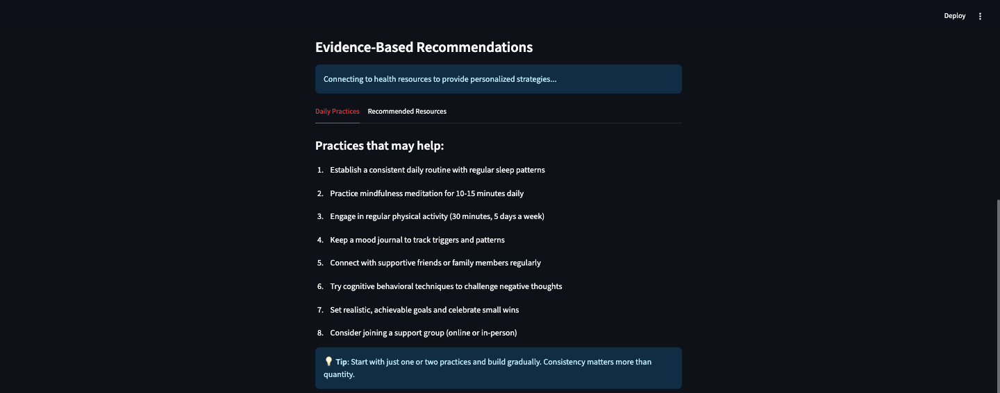
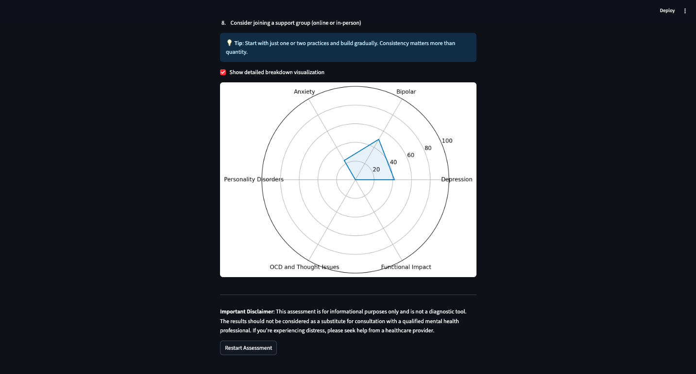

# Mental Health Assessment (OldGeek)

This is a **Streamlit-based mental health assessment** tool that evaluates user responses and provides insights using **BERT-based NLP models**. The application includes:

- A structured **mental health questionnaire**
- **AI-powered analysis** to predict possible conditions
- **Dynamic recommendations** based on user responses
- **Chatbot-generated explanations** for better understanding

---

## 🚀 Features

✅ **Mental Health Screening** using NLP models  
✅ **BERT-based Classification** for condition prediction  
✅ **Interactive Streamlit UI** for easy access  
✅ **Resource Recommendations** for self-care  
<!-- ✅ **Chatbot Integration** for personalized explanations   -->

---

## 📦 Installation

1. Clone the repository:
   ```bash
   git clone https://github.com/MIHIR-RANJAN/mental-health-assessment.git
   cd mental-health-assessment/Main
   ```

2. Install dependencies:
   ```bash
   pip install -r requirements.txt
   ```

3. Download the BERT model from Google Drive:
   - **[Download Here](https://drive.google.com/drive/folders/1KpMp17fMIxHCWS9jhncwB8ovZ39MFbSL?usp=sharing)**
   - Place the `mental_health_bert_model` folder inside the project directory

4. Run the application:
   ```bash
   streamlit run app.py
   ```

--- 

## 📂 Project Directory Structure
```
mental-health-assessment
│
├── dataset/        # Contains all datasets
├── images/        # Contains all images (app visualization)
├── Main/           # Contains core project files
│   ├── app.py      # Streamlit application
│   ├── main.ipynb  #Main file training code
│   ├── mental_health_bert_model/  # BERT model directory
│   ├── mental_health_bert.pkl    #.pkl file
│   ├── requirements.txt  # Dependencies list
│   ├── requirementsForTraining.txt  # Dependencies list during training
│   ├── README.md   
├── README.md
```

---

## 🛠️ Requirements

Ensure you have the following installed:

- **Python 3.7+**
- **Streamlit**
- **Transformers (Hugging Face)**
- **Torch**
- **BeautifulSoup**
- **Requests**
- **Matplotlib**

---

## 📜 Usage

- Start the application and complete the questionnaire.
- The system will analyze responses and classify potential conditions.
- Recommendations and chatbot insights will be displayed.
- Use the provided links and resources for further assistance.

---

## 🤖 Model Details

- Uses **BERT-based NLP model** for classification.
- Responses are **converted into text** and analyzed.
- Generates **personalized explanations** using a chatbot.

---

## 📸 Step-by-Step App Walkthrough

Below are snapshots demonstrating how the Mental Health Assessment tool works:

### 1️⃣ Home Screen  
The landing page introduces users to the app and outlines the assessment process.  


### 2️⃣ Section - 1 (Mood and Energy)  
Users provide basic answers to these questions to define their daily energy levels.  


### 3️⃣ Section - 2 (Anxiety and Stress)  
A structured questionnaire designed to gain insights into anxiety and stress levels.  


### 4️⃣ Section - 3 (Behavioral Patterns)  
This section analyzes the user's behavior patterns.  


### 5️⃣ Section - 4 (Thought Patterns)  
This section gathers insights into the user's thoughts and cognitive patterns.  


### 6️⃣ Section - 5 (Social and Functional Impact)  
This section evaluates how social and environmental factors impact the user.  


### 7️⃣ Detailed Condition Breakdown  
The BERT-based NLP model processes the responses and provides a high-level analysis of the user's mental health status. The system further classifies possible conditions.  


### 8️⃣ Recommendations & Resources  
Based on the results, personalized self-care resources and guidance are displayed.  


### 9️⃣ Chatbot Explanation  
An AI-powered chatbot offers insights and explanations about the results.  


---


## 📌 Disclaimer

This tool is for informational purposes **only** and does not replace professional medical advice. If you or someone you know is struggling, please consult a qualified mental health professional.

---

### 🔗 Contact
Name: Mihir Ranjan & Shuvo Mistry  
📞 Phone: +91 9631997254 & +91 8218160597  
📧 Email: [mihir29062001@gmail.com](mailto:mihir29062001@gmail.com) & [shuvomistry.nfsu@gmail.com](mailto:shuvomistry.nfsu@gmail.com)  
🔗 GitHub: [MIHIR-RANJAN](https://github.com/MIHIR-RANJAN)  
🔗 LinkedIn: [Mihir Ranjan](https://www.linkedin.com/in/mihir-ranjan-328503201/)
